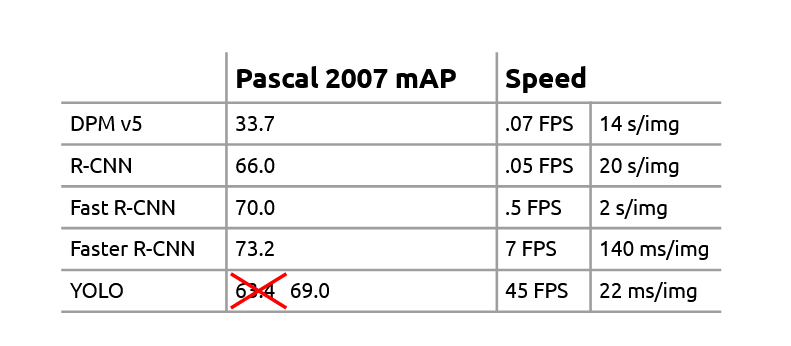

# **Tensorflow implementation of YOLOv1**
---
## Usage 
- You will have to download and extract the voc 2007 dataset :
```
$ wget http://pjreddie.com/media/files/VOCtrainval_06-Nov-2007.tar
$ wget http://pjreddie.com/media/files/VOCtest_06-Nov-2007.tar
$ tar -xvf VOCtrainval_06-Nov-2007.tar
$ tar -xvf VOCtest_06-Nov-2007.tar
```

- Next you will have to update the config.json file with the path to the train and test VOCdevkit that you just extracted.

- Running the main file will train and perform the inference as well

```$ python3 ./main.py```

- The results are stored in the results.npy file 
## Contributed by 
* [Prem Bharwani](https://github.com/dirtbkr)
## References 
 Research Paper Referred to : 
- **Title** : You Only Look Once: Unified, Real-Time Object Detection
- **Authors** : Joseph Redmon, Santosh Divvala, Ross Girshick, Ali Farhadi
- **Link** : [Link to the YOLOv1 Paper](https://arxiv.org/abs/1506.02640)
- **Tags** : Neural Network, RCNN
- **Year Published** : 2015

 Other resources referred to : [Blog1](https://hackernoon.com/understanding-yolo-f5a74bbc7967) | [Blog2](https://www.maskaravivek.com/post/yolov1/) 
 ## **Summary**
### Overview of Object Detection models then and how did YOLOv1 improve upon the exisiting models :

Object detection involves object localisation and classifying object(s) present in the image. 
The already existing models like R-CNN (Region based Convolutional Neural Networks) , DPM(Deformable Parts Model) were making use of classifiers to perform detection ,i.e , they evaluate a particular classifier at different locations of the image.

DPM uses a sliding windows which moves around the image , and a classifier is run on these windows at different locations on the image.
R-CNN first extracts the region using selective search and then classifies the regions using CNN based classifiers.

So the exisiting models involve processing(looking at) the image a large number of times ! The process is time consuming , thereby cannot perform 'satisfactory' realtime detection.

The proposed model improves drastically in the speed aspect , the YOLO model processes(Looks at) the image only once ! And, that is why the name, You Only Look Once.

Below is the comparision model to prove the facts :


### Speed Improvement 
As mentioned earlier, the already existing models made use of classifiers to perform detection. But YOLO frames object detection as a regression problem !
Models like R-CNN , DPM involve a complex pipeline , these make the model really slow and difficult to optimize. And you will have to train each part of this pipeline seperately.

Yolo model involves a single network which takes the image as the input and outputs the bounding boxes and the class probabilities in one evaluation! And since the whole detection network is a single pipeline , it can be optimized end-to-end directly on detection performance.


 
 
 
 
 
 
 
 
 --
 
 
 
 
 --
 
